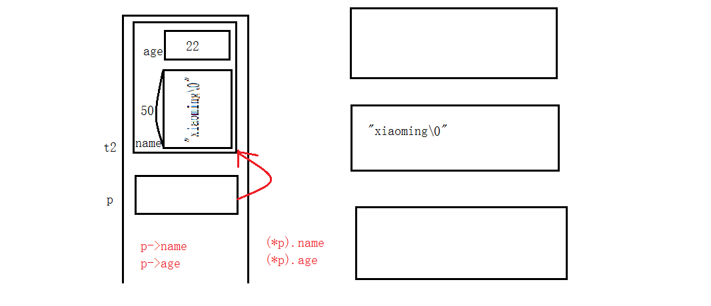
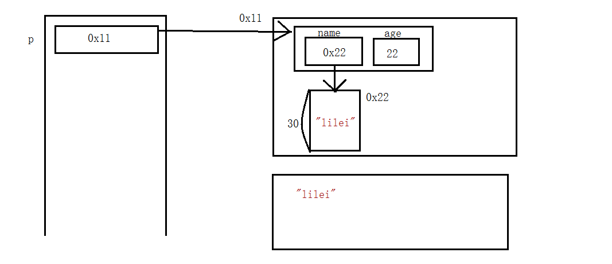

# 结构体
## 基本操作
### 结构体类型定义
结构体也是一种数据类型（复合类型，自定义类型）  
```
//struct关键字
//struct+Teacher合在一起才是类型
//{}后面有分号
struct Teacher
{
  char name[50];
  int age;
};
```
### 结构体变量定义
```
//方法一：先定义类型，再定义变量（常用），可以定义全局变量，也可以定义局部变量
struct Teacher t1;  //全局变量

int main()
{
  struct Teacher t2;  //局部变量
  return 0;
}
```
```
//方法二：定义类型的同时定义变量（不常用）
struct Teacher
{
  char name[50];
  int age;
}t3,t4;
```
### 结构体变量初始化
```
//方法一：定义变量时初始化
struct Teacher t3 = {"john",18};
```
```
//方法二：定义类型、变量时直接初始化
struct Teacher
{
  char name[50];
  int age;
}t3 = {"tom",66};
```
### 结构体变量输出
```
printf("%s, %d\n", t3.name, t3.age);
```
### typedef改类型名
```
typedef struct Teacher 
{
  char name[50];
  int age;
}Teacher;

struct Teacher t5;
Teacher t6;   //两种定义方式均可
```
### 点运算符和指针法操作结构体
```
//点运算符
strcpy(t2.name, "xiaoming")
t2.age = 22;

printf("%s, %d\n", t3.name, t3.age);
```
```
//指针法(新手经常犯错）
struct Teacher *p = NULL;
p = &t2;  

strcpy(p->name, "xiaomi")
p->age = 22;

printf("%s, %d\n", p->name, p->age);
```
结构体内存四区图：  
  
### 结构体相互赋值
相同类型的两个结构体成员，可以相互赋值
```
//注：定义结构体类型时不要直接给成员赋值（结构体只是一个类型，并没有分配空间，只有根据其类型定义变量时才分配空间，有空间才能赋值）
typedef struct Teacher
{
  char name[50];
  //int age = 50; //err
  int age;
}Teacher;

int main()
{
  Teacher t1 = {"lily", 20};
  Teacher t2 = t1;  //把t1的值拷贝给t2，t1和t2没有关系

  return 0;
}
```
### 结构体数组
静态结构体数组的定义：  
```
typedef struct Teacher
{
  char name[50];
  int age;
}Teacher;

int main()
{
  //方法一：
  Teacher a[3] ={
    {"aa",18},
    {"bb",17},
    {"cc",16}
  };
  //方法二：
  Teacher a2[3] = {"a",18,"a",18,"a",18};
  
  //打印
  int i = 0;
  for(i=0;i<3;i++)
  {
    printf("%s,%d\n", a2[i].name, a2[i].age);
  }
  
  return 0;
}
```
动态结构体数组的定义：  
先定义一个动态的int类型的数组  
```
int b[3] = {0};
int *pB = (int *)malloc(3 * sizeof(int));
free(pB);
```
结构体数组的定义与上述类似  
```
Teacher *p = (Teacher *)malloc(3 * sizeof(Teacher));
if (p = NULL)
{
  return -1;
}
```
### 结构体嵌套一级指针
```
//情况一
Teacher t;
t.name = (char *)malloc(30);
strcpy(t.name, "lily");
t.age = 22;
printf("name = %s, age = %d\n", t.name, t.age);

if(t.name != NULL)
{
  free(t.name);
  t.name = NULL;
}
```
```
//情况二
Teacher *p = NULL；
p = (Teacher *)malloc(sizeof(Teacher));
p->name = (char *)malloc(30);
strcpy(p->name, "lild");
p->age = 22;
printf("name = %s, age = %d\n", p->name, p->age);

if(p->name != NULL)
{
  free(p->name);
  p->name = NULL;
}

if(p != NULL)
{
  free(p);
  p = NULL;
}
```
上述代码的内存四区图：   
  


